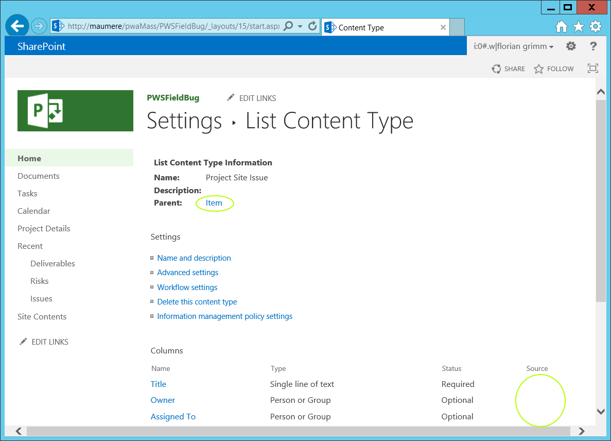

# Microsoft Project's Field Bug

Ein Issue des ProjectServer - genauer in den Listen der Projekte.

Entschuldigung vorweg: Ich nutze hier die Namen des CAML, des SharePoint Server API bzw der englischen Installation, damit habe ich zwar Denglish, aber ich hoff, dass Sie als Bauernhofverwalter meiner Meinung sind: das ist besser so.  

## Motivation

ContentTypes auf SiteCollection Ebene können ins Listen verwendet werden. Änderungen am SiteCollection - ContentType werden an die Listen weitergereicht. 
Bei den Listen des ProjectServers gibt es ContentTypes an der Liste, aber nicht den zugehörigen SiteCollection-ContentType.
Das mehr als nur ein Schönheitsfehler. Beispiel: Wenn man Templates nutzt und eigene Felder hinzufügt und möchte die Reihenfolge ändern, geht das nicht.

## Das Problem



Um dies selbst zu sehen 
- Gehen Sie auf eine Projektsite (OnPremise 2013 / 2016 oder Office365) 
- weiter zu einer Issue-Liste, zu den List Settings
- Schalten Sie "Allow management of content types" ein.
- unter ContentType: Öffnen Sie den Issue - ContentType 

Wo ist das Problem? 

Gehen Sie zu den Parent ContentType - Sie sehen Item. Das ist merkwürdig. Warum? Dazu muß ich jetzt ein bischen ausholen.
(Außerdem wird unter Source kein Wert angezeigt.)


## I'm sitting here in a boring room

    Die Projectserver Listen von SharePoint haben ContentTypes: 


|  Name | ContentTypeId  |
|-------|----------------|
| $Resources:pws,CType_PWS_Commitment | 0x010074416DB49FB844b99C763FA7171E7D1F|
| $Resources:pws,CType_PWS_Document | 0x0101008A98423170284beeB635F43C3CF4E98B|
| $Resources:pws,CType_PWS_Issue | 0x0100DD9A1416BBC74a968F6E648718051133|
| $Resources:pws,CType_PWS_Risk | 0x010024290FBE2869495eB819832776560730|


*Bemerkungen:*

1) Die Namen sind in dem SharePoint Format für Internationalisierung.
2) Der ContentTypeId ist hierachisch aufgebaut. Ein ContentType hat einen Elter (bis auf den Wurzel-ContentType 0x - System). 
    Das Format der ContentTypeIds ist in https://msdn.microsoft.com/en-us/library/office/aa543822(v=office.14).aspx beschrieben.

Der Issue - ContentType (0x0100DD9A1416BBC74a968F6E648718051133) hat also Item(0x01) als Elter.

Ein ContentType in einer Liste hat einen Elter. Ist dieser ContentType speziell für diese Liste, ist es der ContentType "Item" (0x01). 
SharePoint kann aber auch ContentTypes für Listen gemeinsam nutzen. Dazu wird ein Kind des ContentTypes in die Liste gehängt.
Also hat der ContentType der Liste den ContentTypeId 0x0100DD9A1416BBC74a968F6E64871805113300GUID.

Der "Issue" ContentType der Liste hat dies aber nicht - denn er hat ja direkt auf "Item" (0x01) verwiesen. Oder?
Falls Sie noch nicht genau wissen was ich meine, erzeugen Sie einen eigenen ContentType und eine Liste und schauen Sie sich die Situation da an.

Betrachtet man den "Issue" - ContentType genauer, stellt man fest, dass der ContentTypeId 0x0100DD9A1416BBC74a968F6E64871805113300GUID lautet.
Sie können entweder SharePointManger - http://spm.codeplex.com bemühen 
oder Sie schauen sich die URL für das Editieren des ContentTypes genauer an.<br/>
Die Seite von dem der Screenshot aufgenommen wurde, ist: .../PWSFieldBug/_layouts/15/start.aspx#/_layouts/15/ManageContentType.aspx?List=...ctype=0x0100DD9A1416BBC74A968F6E648718051133008F14FA0EBB1CBA4E8E5318D2DE914FD1<br/>
Der ctype Paremeter ist die ContentTypeId.
Geht man die Hierachie noch oben durch:
- 0x0100DD9A1416BBC74A968F6E648718051133008F14FA0EBB1CBA4E8E5318D2DE914FD1  Die ContentTypeId des Listen-ContentType.
- 0x0100DD9A1416BBC74A968F6E648718051133 Die ContentTypeId des SiteCollection-ContentType.
- 0x01 - Item

## Forgotten Sons

    Warum fehlt dieser ContentType? Wieso funktionieren die Listen?

Die ContentTypes sind Teil eines Features. 
Das Feature PWSCTypes (PWSCTypes\pwsctypes.xml) definiert die ProjectServer ContentTypes.

Leider kann man das Feature nicht aktivieren, weil es eine Abhängigkeit zu dem Feature PWSFields hat.

Und PWSFields Feature kann man nicht aktivieren, weil es schon vergebene Namen für Fields verwendet.
pwsfields.xml definiert die Fields, die in den ContentTypes via FieldRefs referenziert werden.

## The Naming of Cats is a difficult matter

    Ein SharePoint Field (aka Column) hat 3 Namen: Name, StaticName und DisplayName. 

Eine wenig hilfreiche Erklärung liefert das SharePoint SDK: https://msdn.microsoft.com/en-us/library/aa979575(v=office.15).aspx

Eine kein bisschen deutlicher Erklärung ist:

Der Name muß eindeutig sein.
Die unterschiedlichen APIs nutzen nicht immer den gleichen Namen, wobei DisplayName manchmal Sprachen abhängig ist.

In FEATURES\fields\fieldswss3.xml wird ein Field "Description" definiert:

```XML
<Field ID="{3f155110-a6a2-4d70-926c-94648101f0e8}"
        Name="Description" />
```

In FEATURES\PWSFields\pwsfields.xml wird ein Field "Description" definiert:
```XML
  <Field ID="413213C2-3E91-4dc8-9D47-216B83AB8027"
      Name="Description" />
```

Die ID ist eine andere, aber "Name" hat den gleichen Wert - beide Features können nicht gleichzeitig aktiviert sein. Und FEATURES\fields ist immer aktiviert (und muss auch, denn da sind alle core Fields drin, ohne die geht gar nichts).  


## Hello is there anybody in there?

    Also warum funktioniert das Ganze überhaupt?

Nun, eine SharePoint Liste unter WSS2 hatte keine ContentTypes. Es gab nur die Fields in der Liste.
WSS3 hat ContentTypes mitgebracht. Ein Field im ContentType hat auch ein Field in der Liste.
Definiert man in CAML ein Liste kann man unter "Fields" die Definition hinterlegen.
Möchte man bestimmte SiteCollection - ContentTypes nutzen, kann man diese mittels ContentTypeRef einbeziehen.
Man kann auch beides machen. 
Schaut man sich "TEMPLATE\FEATURES\PWSIssues\PWSISSUE\schema.xml" genauer an, wird beides gemacht. 

Die Fields sind da, der ContentType wird benutzt, ohne zu existieren.

## No, Woman, No Cry

Ein paar Lösungen dazu findet man im Netz, diese löschen und erzeugen wild irgendwelche Listen, ContentTypes... 

Der hier vorgestellte Lösungsansatz will die Fields und die ContentType, so nah wie möglich an der ursprünglichen Definition erzeugen.

Basis hierfür ist https://github.com/OfficeDev/PnP-powershell und die Definitionen von SharePoint.

Die Idee:

1) Die Definitionen der Fields anpassen, so dass Namenskonflikte nicht mehr auftreten (pws als Prefix für die Namen), die FieldRefs und Formeln anpassen 
2) Die Fields mit der modifizerten Defnition erzeugen.
3) Die ContentTypes erzeugen.
4) Die Fields dem ContentType hinzufügen.


Los gehts.

1) Installieren sie https://github.com/OfficeDev/PnP-powershell.
2) Öffnen Sie das Script im ISE.
2) Passen sie den Wert für $url an - geben sie die SiteCollection an die sie ändern möchten.
3) Passen Sie ggf die Pfade an je nach SharePoint Version.
4) Führen sie das Script aus.
5) Testen.

```powershell
# 
$url = "https://your/pwa"
$fieldsFileNameSP = "C:\Program Files\Common Files\microsoft shared\Web Server Extensions\15\TEMPLATE\FEATURES\PWSFields\pwsfields.xml"
$ctypesFileNameSP = "C:\Program Files\Common Files\microsoft shared\Web Server Extensions\15\TEMPLATE\FEATURES\PWSCTypes\pwsctypes.xml"

function fixPWSFieldBug(){ ...  }

Connect-PnPOnline -Url $url
fixPWSFieldBug
```

## Ade zur guten Nacht

Ich hoffe sie finden es hilfreich.

Bitte selbst vorher testen.
